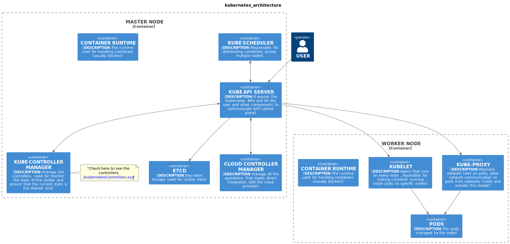

# KUBERNETES FOUNDAMENTALS 

In questa sezione andremo a fare un piccolo approfondimento sull'architettura base di kubernetes e le differenze tra un installazione on premise e una soluzione eks.
L'architettura standard di un cluster kubernetes si divide tra architettura dei nodi master e l'architettura dei nodi worker, anche se i nodi master e worker lavorano insieme all'interno di un unico cluster, l'architettura dei componenti è diversa, i nodi manager controllano le operazioni e lo stato del cluster mentre i nodi worker sono i nodi che si occupano di eseguire gli applicativi containerizzati e gestire i carichi di lavoro.
L'utente si interfaccia con i nodi master ,attraverso l'utilizzo di una CLI o di una UI, come in una classica architettura client server

## Componenti nel Nodo Worker

Kubelet: Un agente che viene eseguito su ogni nodo all'interno del cluster. La sua responsabilità principale è assicurare che i container siano in esecuzione nei pod assegnati a quel nodo.

Kube-Proxy: Mantiene le regole di rete nei pod e consente la comunicazione tra i pod e la rete, sia all'interno che all'esterno del cluster.

Container Runtime: Il motore che gestisce l'esecuzione dei container. Di solito, in Kubernetes, il runtime è Docker.

## Componenti nel Nodo Master

Kube API Server: Fornisce l'API principale per interagire con Kubernetes. Gli utenti e altri componenti usano questa interfaccia per comunicare con il piano di controllo.

ETCD: Un archivio chiave-valore usato per conservare i dati dell'intero cluster. Contiene tutte le informazioni sullo stato dei nodi, dei pod, delle risorse e dei servizi.

Kube Scheduler: Assegna i pod ai nodi disponibili nel cluster in base a varie politiche di distribuzione.

Kube Controller Manager: Coordina i vari controller che monitorano lo stato del cluster per assicurarsi che lo stato attuale corrisponda allo stato desiderato.

Cloud Controller Manager: Gestisce tutte le operazioni che richiedono un'integrazione diretta con il fornitore di servizi cloud.

Container Runtime: Anche il nodo master può avere un runtime dei container, simile al nodo worker.

## Flusso dei Dati

L'utente interagisce principalmente con il nodo Master tramite il Kube API Server.
I nodi Worker eseguono i container runtime che effettivamente ospitano le applicazioni e i servizi richiesti.
I nodi Master supervisionano e gestiscono l'intero cluster, assicurando che le risorse vengano allocate e distribuite correttamente.

Questa struttura permette a Kubernetes di essere un sistema scalabile, resiliente e autonomo, capace di gestire carichi di lavoro complessi e variegati in modo efficiente.
